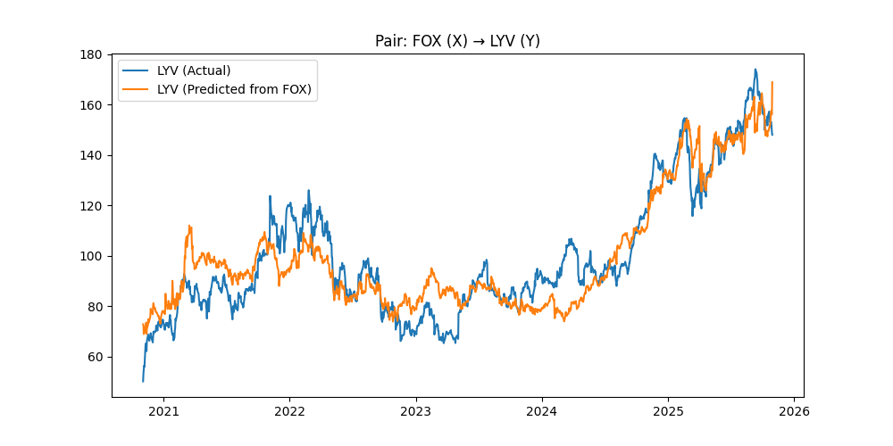
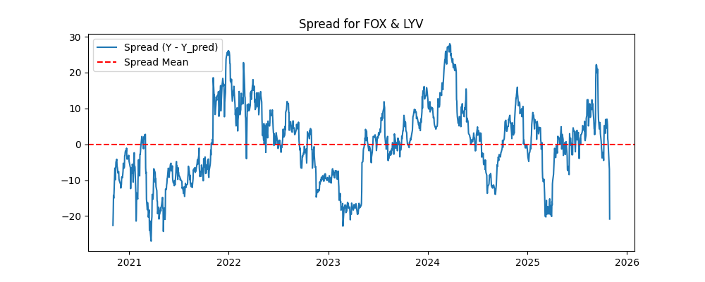
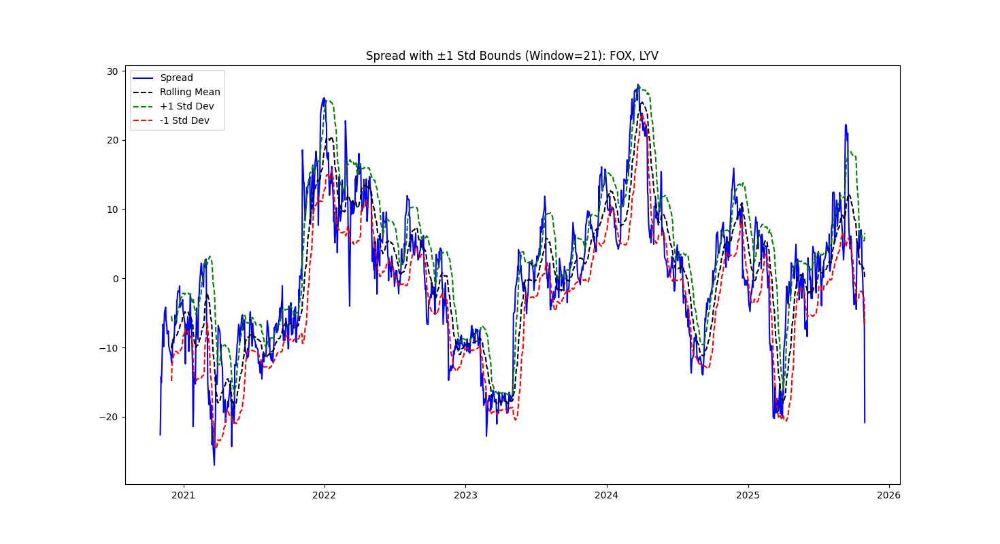
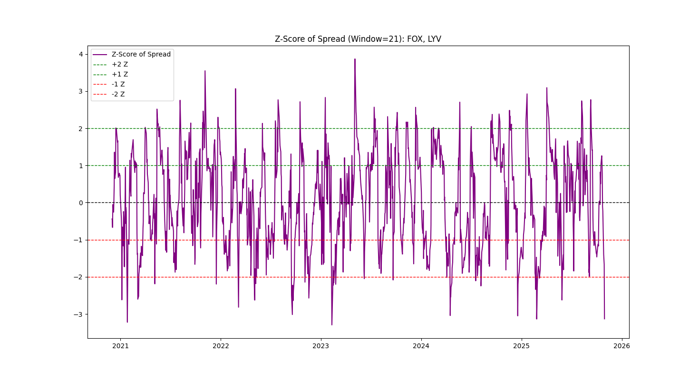

# Statistical Arbitrage using Cointegration

This project demonstrates a complete workflow for building and backtesting a simple pairs trading strategy using the Engle-Granger cointegration approach. It includes steps for data retrieval, cointegration testing, spread analysis, Z-score normalization, and strategy backtesting.

---

## Overview

- **Stock Universe**: Selected from the Media & Entertainment industry (e.g., DIS, NFLX, CMCSA, FOX, LYV).
- **Data Source**: Yahoo Finance (5 years of daily data, adjusted prices).
- **Cointegration Testing**: Engle-Granger method to find pairs that share a long-term equilibrium relationship.
- **Spread Analysis**: Regression-based spread visualization between cointegrated pairs.
- **Z-score Transformation**: Standardization of spread using rolling mean and standard deviation.
- **Backtesting**: Basic long-short pairs trading strategy using Z-score entry/exit rules.

---

## Project Structure

```
src/
│
├── data_loader.py          # Fetches data from yFinance
├── cointegration.py        # Performs Engle-Granger cointegration tests
├── spread_analysis.py      # Fits OLS and plots actual vs predicted prices
├── utils.py                # Converts spread into rolling Z-scores
├── backtest.py             # Runs pairs trading backtest and calculates metrics
└── main.py                 # Pipeline execution script
```

---

## How to Run

1. Install dependencies:
   ```bash
   pip freeze > requirements.txt
   pip install -r requirements.txt
   ```

2. Run the full workflow:
   ```bash
   python src/main.py
   ```

---

## Visualization Outputs

All plots are saved in the `assets/` directory.

| Image | Description |
|--------|-------------|
|  | Regression fit of LYV predicted from FOX |
|  | Spread between actual and predicted prices |
|  | Spread with ±1 standard deviation bounds |
|  | Z-score of spread used for trade signals |

---

## Notes

- The strategy uses 2% equity allocation per leg.
- Z-score thresholds are set at ±2 for entry and ±1 for exit.
- Performance metrics include Sharpe, Sortino, Max Drawdown, and Win Rate.

